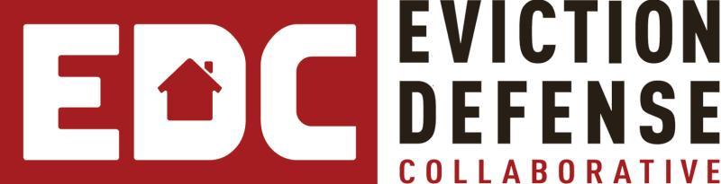

<center-l max="120ch">
<cluster-l justify="space-between" align="flex-end" space="var(--s1)" id="hero-copy">
<stack-l space="var(--s1)" >
<hgroup>
 <stack-l space="var(--s1)">

  
intake health check · fixed fee · 2 weeks

# Solve the <strong>Intake Bottleneck</strong>

</stack-l>
</hgroup>

See exactly where your legal aid client intake is breaking, what it’s costing your staff, and how to fix it, before you spend a dollar on any platform or tool.{.subhed}

* Scored report leadership can act on
* Two weeks from survey to results
* $2,500 fixed fee; no hourly billing
{.list-check}

<a class="button" href="#fa-contact-form" id="button-solve">get intake health check</a>

</stack-l>

</cluster-l>
</center-l>

  <center-l max="120ch" class="wrapper">
  

  <stack-l space="var(--s1)" id="how-it-works">

<hgroup>
 <stack-l space="var(--s1)">

  
how it works

## Two Weeks, Four Steps

</stack-l>
</hgroup>

1. Survey: Your team documents every inbound channel
2. Interviews: We talk with the staff who live intake daily
3. Scored Report: Named bottlenecks, affected roles, time cost, peer benchmarks
4. Leadership Brief: Prioritized findings your executive team can act on immediately

### You walk away with&colon;

* A current-state intake flow map across phone, web, walk-in, and referral
* A scored bottleneck analysis naming specific breakpoints and the staff time they consume
* A peer benchmark comparison against similar legal aid organizations
* A leadership briefing built to unlock your capacity & earn board sponsorship
{.list-check-alt}

<small id="neutral">No new software required. No disruption to daily operations. Platform-neutral: Works with whatever system you use today.</small>

<a class="button button-primary hide-wide" href="#fa-contact-form">get intake health check</a>

<hgroup>
<stack-l>

fix what’s broken

## Intake Pain Compounds Every Day You Wait

</stack-l>
</hgroup>

* **Too many channels**: Phone, web forms, walk-ins, and referrals arrive all at once, with different levels of completeness
* **Endless callbacks**: Staff chase calls with clients before eligibility can even begin
* **No clear picture**: Screening times stretch, decisions vary by who answers, and nobody can point to exactly where the process breaks

Before you invest in technology, you need to see where it’s actually breaking. That’s what this health check does, in two weeks, for a reasonable micro-purchase of $2,500.{.before-form}

  </stack-l>
<stack-l space="var(--s1)">

## get your intake health check{.heading-small}

All fields marked with an asterisk (*) are required.

</stack-l>
  

  </center-l>

<!-- end #process-plus-form-wrapper -->

  <center-l max="120ch" class="wrapper">
   <stack-l space="var(--s1)">

## a proven record{.heading-small}

<blockquote><stack-l space="var(--s1)">

There are some powerful advantages that come with using this Justiceserver Intake Wizard. We&rsquo;re able to capture the entire intake work, from start to finish, which we couldn&rsquo;t capture with earlier solutions. We can run reports on the average times to complete intake based on problem code, etc. and really gain insights. For example, we could look at priorities differently when we could see we do 200 housing intakes in the same time it takes to do 20 family law intakes, etc. There are real improvements to our overall processes that we can make with these insights.

<cite>—&zwj;&hairsp;&zwj;Sarah Cross, Project Manager, Lakeshore Legal Aid</cite>
</stack-l></blockquote>

The Intake Health Check is delivered by Techbridge, the nonprofit team behind Justiceserver, trusted by legal services organizations nationwide for over two decades.

</stack-l>
</center-l>

<center-l max="160ch" class="wrapper">

<cluster-l justify="space-around" align="center" space="var(--s1)" >      
</cluster-l>
</center-l>

  <center-l max="120ch" class="wrapper">
  <stack-l space="var(--s5)">
    <sidebar-l side="right" space="var(--s2)" sideWidth="35ch" noStretch>
    <stack-l space="var(--s1)">

<hgroup>
 <stack-l space="var(--s1)">

  
the visibility you need

## See Where Your Intake Is Breaking, and What It’s Costing You

</stack-l>
</hgroup>

$2,500. Two weeks. A scored report and leadership brief your whole organization can act on.

<a class="button button-primary" href="#fa-contact-form">get intake health check</a>

  </stack-l>

